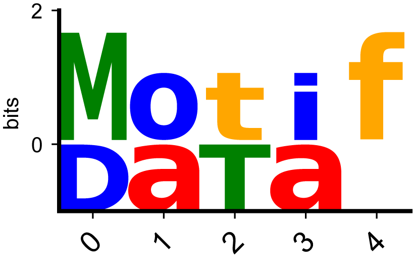

[](https://badge.fury.io/py/motifdata)



# MotifData - Motif analysis toolkit in Python
The data structure for motifs utilized in EUGENe.

```python
import motifdata as motif
```

# What MotifData does
- MotifData’s main purpose is to help with extracting and inserting motif information into models
- MotifData is therefore very simple
- MotifData enables users use motifs as an inductive bias for their models
    - Download motifs from popular databases (e.g. JASPAR) —> instantiate model parameters (most likely convolutions) —> train a model using these parameters
    - Load motifs from popular files on-disk —> instantiate model parameters (most likely convolutions) —> train a model using these parameters
- MotifData aides users in extracting learned motifs from a trained model
    - Save PFMs generated from model activations in common file formats and run downstream analysis (e.g. TomTom)
    - Save PFMs generated from TF-modisco in common file formats and run downstream analysis (e.g. TomTom)

## What MotifData *does not* do
- MotifData is meant for Motif extraction, not for Motif analysis
- We have notebooks in the EUGENe_paper repo that showcase how to use Motifs from trained models, saved using MotifData with other tools (e.g. TomTom)
